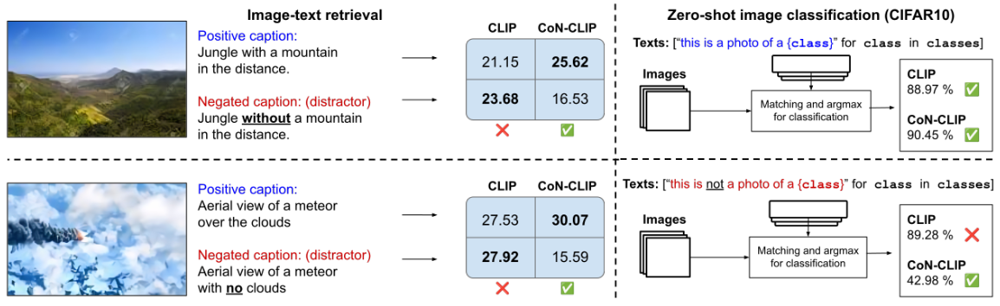
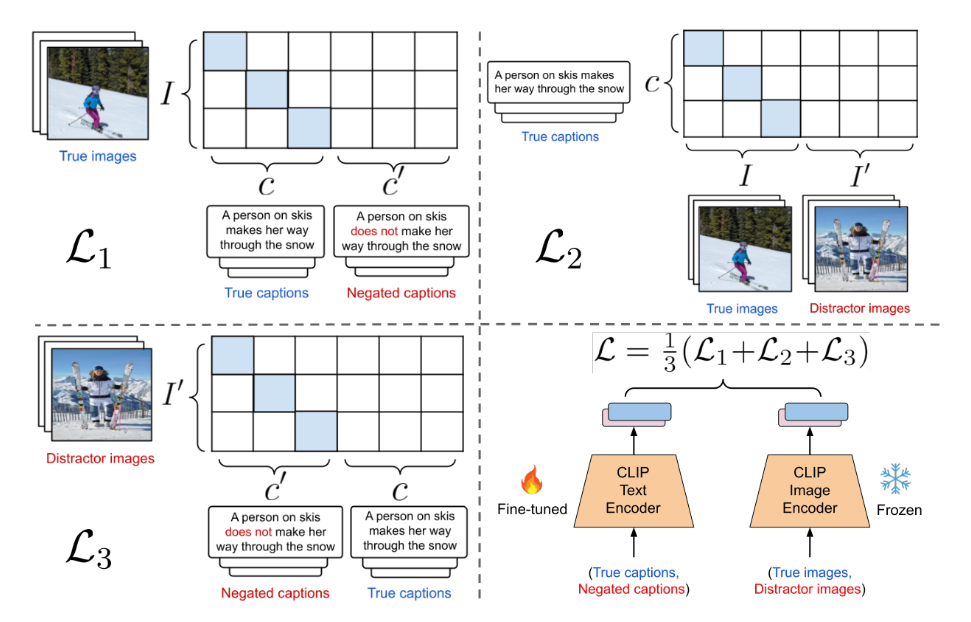
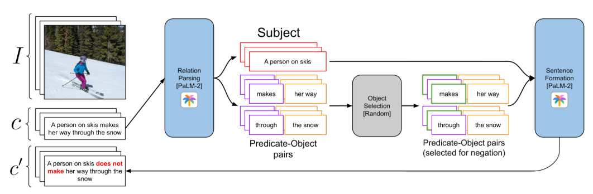
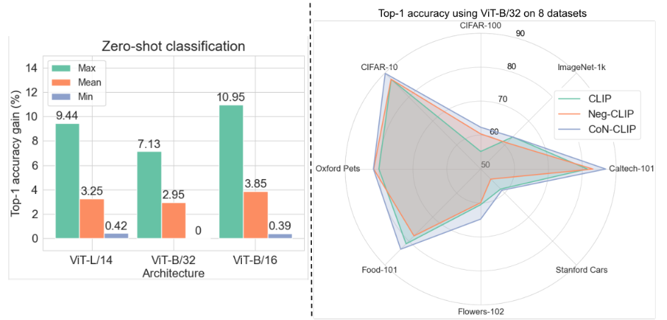
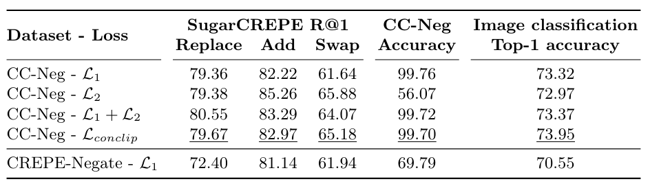

# Learning the Power of “No”: Foundation Models with Negations (WACV 2025)

This repository releases the official code, checkpoints, and data for our paper (arXiv preprint can be found <a href="https://arxiv.org/abs/2403.20312">here</a>). The following provides CoN-CLIP checkpoints and usage instructions for the *ViT-L/14, ViT-B/16, and ViT-B/32* backbones of <a href="https://github.com/openai/CLIP">CLIP</a>. Our dataset CC-Neg has been prepared for release and instructions to access it are given below.



## CoN-CLIP



### Checkpoints

The checkpoints for CoN-CLIP are given in the table below. Note that since these are OneDrive links, it can be useful to use a command line tool given <a href="https://github.com/loribonna/onedrivedownloader">here</a>.

Model name        | CLIP Backbone | Checkpoint
----------------- | ------------- | ----------
CoN-CLIP ViT-B/32 | ViT-B/32      | <a href="https://iitjacin-my.sharepoint.com/:u:/g/personal/singh_118_iitj_ac_in/Eb-3taJSENpIu5sL85FmJmMB1Bf9J_2DxXswgT0E24z9Ng?e=Xipvn3">Link</a>
CoN-CLIP ViT-B/16 | ViT-B/16      | <a href="https://iitjacin-my.sharepoint.com/:u:/g/personal/singh_118_iitj_ac_in/EZYIVy01n11EvuHoT-aQCfQBWsgah2GRIOPBKrrrDPwYDQ?e=3WJiXm">Link</a>
CoN-CLIP ViT-L/14 | ViT-L/14      | <a href="https://iitjacin-my.sharepoint.com/:u:/g/personal/singh_118_iitj_ac_in/ESfvjZ43t4hGmJkumiMk5rQB2Voz5ke_s5y12k2u6eA7ww?e=1rVc8U">Link</a>


### Loading and Using CoN-CLIP

The checkpoint contains the model weights, the optimizer state, and fine-tuning logs. To access and load the model weights, the following code snippet can be used.

```python
import clip
import torch
from PIL import Image


def load_checkpoint(model, checkpoint_path):
	ckpt = torch.load(checkpoint_path)
	model = model.float()
	model.load_state_dict(ckpt["model"])
	return model


# the .pt file downloaded from the links above
checkpoint_path = "ckpt_5_conclip_b32.pt"

device = "cuda"
model, preprocess = clip.load("ViT-B/32", device=device)
model = load_checkpoint(model, checkpoint_path)
model = model.to(device)

# now you can use the model as you would use any CLIP model.
image = preprocess(Image.open("dog.jpeg")).unsqueeze(0).to(device)
texts = ["this is a photo of a dog", "this is not a photo of a dog"]
texts_tokenized = clip.tokenize(texts).to(device)

with torch.no_grad():
	image_features = model.encode_image(image)
	text_features = model.encode_text(texts_tokenized)

	image_features /= image_features.norm(dim=-1, keepdim=True)
	text_features /= text_features.norm(dim=-1, keepdim=True)

	sim = (100 * image_features @ text_features.T).softmax(dim=-1)
	print(sim)
```

## CC-Neg: Benchmark for Understanding of Negations

Detailed instructions for downloading and setting up our CC-Neg dataset are given <a href="./ccneg_dataset/README.md">here</a>. The `ccneg_dataset` directory stores this data by default.



### Loading CC-Neg for Evaluating VLMs

After setting up the dataset as per the instructions given <a href="ccneg_dataset/README.md"></a>, the CC-Neg dataset can be loaded for evaluating CLIP-like VLMs using the following code snippet.


```python
import clip
from tqdm import tqdm
from data import CCNegEvalDataset
from torch.utils.data import DataLoader
import torch.nn.functional as F


device = "cuda"
model_name = "ViT-B/32"

def collate_fn(batch):
	images = [item[0] for item in batch]
	true_captions = [item[1][0] for item in batch]
	negated_captions = [item[2][0] for item in batch]

	return (images, true_captions, negated_captions)

@torch.no_grad()
def evaluate_clip_on_ccneg():
	model, preprocess = clip.load(model_name, device=device)

	ccneg_dataset = CCNegEvalDataset(transform=preprocess)
	# (transformed_image_tensor, [true_caption], [false_caption]) = ccneg_dataset[0]

	loader = DataLoader(ccneg_dataset, batch_size=200, pin_memory=True, collate_fn=collate_fn)
	bar = tqdm(total=len(loader))
	correct, total = 0, 0

	for (images, true_captions, negated_captions) in loader:
		batch_size = images.shape[0]

		images = images.float().to(device)
		true_captions = clip.tokenize(true_captions).to(device)
		negated_captions = clip.tokenize(negated_captions).to(device)

		image_features = model.encode_image(images) # shape: [batch_size x embedding_dim]
		true_caption_features = model.encode_text(true_captions) # shape: [batch_size x embedding_dim]
		negated_caption_features = model.encode_text(negated_captions) # shape: [batch_size x embedding_dim]
		true_caption_features = F.normalize(true_caption_features, dim=-1)
		negated_caption_features = F.normalize(negated_caption_features, dim=-1)

		sim_dense_true = (model.logit_scale * image_features @ true_caption_features.T) # shape: [batch_size x batch_size]
		sim_true = torch.diag(sim_dense_true).view(batch_size, 1) # shape: [batch_size x 1] (similarity of the image to its true caption)

		sim_dense_neg = (model.logit_scale * image_features @ negated_caption_features.T) # shape: [batch_size x batch_size]
		sim_neg = torch.diag(sim_dense_neg).view(batch_size, 1) # shape: [batch_size x 1] (similarity of the image to its true caption)

		sim = torch.cat([sim_true, sim_neg], dim=1)
		preds = sim.argmax(dim=-1)

		labels = torch.zeros(batch_size).to(device) # since true captions are at column 1 in `sim`

		correct += (preds == labels).sum().item()
		total += batch_size
		accuracy = round(correct/total * 100, 2)

		bar.set_postfix({"accuracy": accuracy})
		bar.update(1)

```

### Finetuning CLIP using CC-Neg

Our model CoN-CLIP can be prepared by fine-tuning CLIP using CC-Neg. This can be done using the `src/conclip_fine_tuning.py` file. For convenience, we run this file using a shell script with elucidated args. The following command can be used to launch that shell script.

```bash
cd src
sh run_finetuning.sh
```

## Zero-shot Image Classification

Our paper reports the performance of CoN-CLIP on the zero-shot image classification task. We use 8 datasets: ImageNet-1k, CIFAR-100, CIFAR-10, Stanford Cars, Caltech-101, Food-101, Flowers-102, and Oxford Pets. These datasets can be downloaded and prepared from their respective sources and can be used to evaluate CoN-CLIP, yielding results similar to the following.




## Compositional Understanding

For the compositional understanding task, our paper uses SugarCREPE, an unbiased dataset used to evaluate the compositionality of VLMs. We find that CoN-CLIP outperforms CLIP on this task and domain, as do variants of it when $\mathcal{L}_{conclip}$ is ablated. These results are shown below.



## Citation

If you found our work helpful in your research, please cite it using the following bibtex snippet.

```bibtex
@misc{singh2024learn,
      title={Learn "No" to Say "Yes" Better: Improving Vision-Language Models via Negations}, 
      author={Jaisidh Singh and Ishaan Shrivastava and Mayank Vatsa and Richa Singh and Aparna Bharati},
      year={2024},
      eprint={2403.20312},
      archivePrefix={arXiv},
      primaryClass={cs.CV}
}
```
